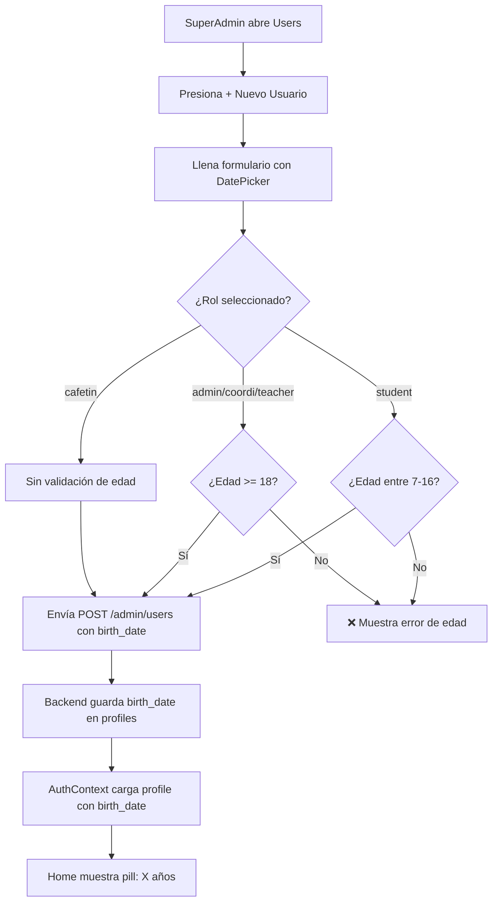

# Guía: Fecha de Nacimiento + Validación de Edad + Pill de Edad

Guía paso a paso para agregar la fecha de nacimiento al formulario de creación de usuarios (SuperAdmin), validar la edad según el rol, mostrar una pill con la edad en Home, y guardar el dato en la base de datos.

---

## Paso 1: SQL — Agregar columna `birth_date` a la tabla `profiles`

Ejecuta este SQL en el **SQL Editor de Supabase**:

```sql
-- Agregar la columna de fecha de nacimiento
ALTER TABLE profiles 
ADD COLUMN IF NOT EXISTS birth_date DATE;
```

> [!NOTE]
> La columna es de tipo `DATE` (solo fecha, sin hora). Se permite `NULL` para usuarios ya existentes que no tengan este dato.

---

## Paso 2: Frontend Mobile — Modificar [`users.jsx`](file:///c:/Users/Edgar/Documents/CreaJ-2026/Cokie_college/mobile/app/users.jsx)

### 2.1 Agregar el import del DateTimePicker

En la parte superior del archivo (línea ~6), agregar el import tal como se usa en [`justifications.jsx`](file:///c:/Users/Edgar/Documents/CreaJ-2026/Cokie_college/mobile/app/justifications.jsx#L6):

```javascript
import DateTimePicker from '@react-native-community/datetimepicker';
```

También necesitas importar el ícono `Calendar` de lucide. Modifica la línea 5 para incluirlo:

```javascript
import { Search, Plus, Trash2, Edit2, X, ChevronDown, User, Mail, Shield, Book, Calendar } from 'lucide-react-native';
```

### 2.2 Agregar estado para el DatePicker

Después de los dropdown states (~línea 32), agregar:

```javascript
const [showBirthDatePicker, setShowBirthDatePicker] = useState(false);
```

### 2.3 Agregar `birth_date` al formData

En el estado `formData` (línea 35-44), agregar el campo:

```javascript
const [formData, setFormData] = useState({
    full_name: '',
    first_surname: '',
    second_surname: '',
    email: '',
    role: 'student',
    grade: '',
    section: '',
    level: '',
    birth_date: ''    // ← NUEVO
});
```

> [!IMPORTANT]
> También debes agregar `birth_date: ''` en las dos funciones que resetean el form:
> - [`handleOpenCreateModal`](file:///c:/Users/Edgar/Documents/CreaJ-2026/Cokie_college/mobile/app/users.jsx#L109-L122) (línea 111-120)
> - [`handleOpenEditModal`](file:///c:/Users/Edgar/Documents/CreaJ-2026/Cokie_college/mobile/app/users.jsx#L124-L137) (línea 126-136) → aquí usa: `birth_date: user.birth_date || ''`

### 2.4 Agregar función para manejar el cambio de fecha

Después de las funciones de dropdown (~línea 261), agregar esta función (misma lógica que en justificaciones):

```javascript
const handleBirthDateChange = (event, selectedDate) => {
    setShowBirthDatePicker(false);
    if (selectedDate) {
        const year = selectedDate.getFullYear();
        const month = String(selectedDate.getMonth() + 1).padStart(2, '0');
        const day = String(selectedDate.getDate()).padStart(2, '0');
        const formattedDate = `${year}-${month}-${day}`;
        setFormData(prev => ({ ...prev, birth_date: formattedDate }));
    }
};
```

### 2.5 Agregar función de cálculo y validación de edad

```javascript
const calculateAge = (birthDateString) => {
    const today = new Date();
    const birth = new Date(birthDateString + 'T12:00:00');
    let age = today.getFullYear() - birth.getFullYear();
    const monthDiff = today.getMonth() - birth.getMonth();
    if (monthDiff < 0 || (monthDiff === 0 && today.getDate() < birth.getDate())) {
        age--;
    }
    return age;
};

const validateAge = (birthDate, role) => {
    if (!birthDate) return { valid: false, message: 'La fecha de nacimiento es obligatoria.' };
    
    const age = calculateAge(birthDate);
    
    if (role === 'student') {
        // Alumno: entre 7 y 16 años
        if (age < 7 || age > 16) {
            return { valid: false, message: `La edad del alumno debe estar entre 7 y 16 años. Edad calculada: ${age} años.` };
        }
    } else if (['super_admin', 'coordinator', 'teacher'].includes(role)) {
        // Admin, Coordinador, Docente: mayor de 18
        if (age < 18) {
            return { valid: false, message: `El usuario con rol ${role} debe ser mayor de 18 años. Edad calculada: ${age} años.` };
        }
    }
    // Para 'cafetin' u otros roles, decide tú si quieres validación
    
    return { valid: true, age };
};
```

### 2.6 Agregar validación en `handleSaveUser`

En la función [`handleSaveUser`](file:///c:/Users/Edgar/Documents/CreaJ-2026/Cokie_college/mobile/app/users.jsx#L139-L198) (línea 139), **después** de la validación del email (línea 157) y **antes** de `setSaving(true)` (línea 159), agregar:

```javascript
// Validación de edad
const ageValidation = validateAge(formData.birth_date, formData.role);
if (!ageValidation.valid) {
    showAlert({
        type: 'error',
        title: 'Edad Inválida',
        message: ageValidation.message
    });
    return;
}
```

### 2.7 Agregar `birth_date` a los datos enviados al backend

En el bloque de **Create Mode** (línea 178), el `formData` ya incluye `birth_date` porque se envía todo el objeto. Sin embargo, en el bloque de **Edit Mode** (líneas 163-170), necesitas agregar `birth_date` explícitamente:

```javascript
await api.put(`/admin/users/${editingUser.id}`, {
    full_name: formData.full_name,
    email: formData.email,
    role: formData.role,
    grade: formData.role === 'student' ? formData.grade : '',
    section: formData.role === 'student' ? formData.section : '',
    level: (formData.role === 'coordinator' || formData.role === 'teacher') ? formData.level : '',
    birth_date: formData.birth_date || null   // ← NUEVO
});
```

### 2.8 Agregar el campo DatePicker en el modal del formulario

En el JSX del formulario, **después** del dropdown de Sección (después de la línea 576 donde cierra `{formData.role === 'student' && (...)}`) y **antes** del `<View style={{ height: 30 }} />` (línea 578), agregar:

```jsx
{/* Fecha de Nacimiento */}
<View style={styles.formGroup}>
    <Text style={styles.label}>Fecha de Nacimiento</Text>
    <TouchableOpacity 
        style={styles.dropdownTrigger} 
        onPress={() => setShowBirthDatePicker(true)}
        activeOpacity={0.8}
    >
        <Calendar size={18} color={Colors.text.muted} style={styles.inputIcon} />
        <Text style={[
            styles.dropdownTriggerText, 
            formData.birth_date ? { color: Colors.text.primary, fontWeight: '600' } : null
        ]}>
            {formData.birth_date || 'Seleccionar fecha'}
        </Text>
    </TouchableOpacity>
    {showBirthDatePicker && (
        <DateTimePicker
            value={formData.birth_date ? new Date(formData.birth_date + 'T12:00:00') : new Date()}
            mode="date"
            display="default"
            maximumDate={new Date()}
            onChange={handleBirthDateChange}
        />
    )}
</View>
```

> [!TIP]
> Se usa `maximumDate={new Date()}` para que no se pueda seleccionar una fecha futura. El botón usa el mismo estilo `dropdownTrigger` que ya tienes para mantener la consistencia visual.

---

## Paso 3: Backend — Modificar [`adminController.js`](file:///c:/Users/Edgar/Documents/CreaJ-2026/Cokie_college/backend/src/controllers/adminController.js)

### 3.1 Recibir `birth_date` en `createUser`

En la función [`createUser`](file:///c:/Users/Edgar/Documents/CreaJ-2026/Cokie_college/backend/src/controllers/adminController.js#L52-L129) (línea 54), agregar `birth_date` al destructuring:

```javascript
const { full_name, email, role, grade, section, first_surname, second_surname, level, birth_date } = req.body;
```

### 3.2 Incluir `birth_date` en el INSERT del perfil

En el objeto que se inserta en la tabla `profiles` (líneas 89-98), agregar el campo:

```javascript
.insert([{
    id: authUser.user.id,
    full_name: combinedFullName,
    email,
    institutional_code,
    role,
    grade: grade || null,
    section: section || null,
    level: level || null,
    birth_date: birth_date || null   // ← NUEVO
}])
```

> [!NOTE]
> El `updateUser` (línea 131) **no necesita cambios** porque ya recibe todo el body dinámicamente con `const updates = req.body;` y lo pasa directo al `.update(updates)`.

---

## Paso 4: Frontend Mobile — Mostrar pill de edad en [`home.jsx`](file:///c:/Users/Edgar/Documents/CreaJ-2026/Cokie_college/mobile/app/home.jsx)

### 4.1 Agregar función de cálculo de edad

Dentro de `HomeScreen` (después de la línea 14), agregar:

```javascript
const getAge = () => {
    if (!profile?.birth_date) return null;
    const today = new Date();
    const birth = new Date(profile.birth_date + 'T12:00:00');
    let age = today.getFullYear() - birth.getFullYear();
    const m = today.getMonth() - birth.getMonth();
    if (m < 0 || (m === 0 && today.getDate() < birth.getDate())) {
        age--;
    }
    return age;
};

const age = getAge();
```

### 4.2 Agregar la pill de edad en el JSX

En la sección de [`badgeRow`](file:///c:/Users/Edgar/Documents/CreaJ-2026/Cokie_college/mobile/app/home.jsx#L80-L89) (líneas 80-89), **después** del badge de `level` (línea 88) y **antes** del cierre del `</View>` de badgeRow (línea 89), agregar:

```jsx
{age !== null ? (
    <View style={styles.ageBadge}>
        <Text style={styles.ageBadgeText}>{age} años</Text>
    </View>
) : null}
```

### 4.3 Agregar estilos para la pill de edad

En la función [`createStyles`](file:///c:/Users/Edgar/Documents/CreaJ-2026/Cokie_college/mobile/app/home.jsx#L119-L241) (después del estilo `levelBadgeText` en línea ~187), agregar:

```javascript
ageBadge: {
    backgroundColor: 'rgba(59, 130, 246, 0.25)',
    paddingHorizontal: 12,
    paddingVertical: 5,
    borderRadius: 12,
    borderWidth: 1,
    borderColor: '#3b82f6',
},
ageBadgeText: {
    color: theme === 'dark' ? '#60a5fa' : '#93c5fd',
    fontSize: 11,
    fontWeight: 'bold',
},
```

---

## Paso 5: Dato automático en AuthContext

El [`AuthContext.jsx`](file:///c:/Users/Edgar/Documents/CreaJ-2026/Cokie_college/mobile/src/context/AuthContext.jsx) **no necesita cambios**. Ya hace `select('*')` en la tabla `profiles` (línea 34), por lo que el campo `birth_date` se incluirá automáticamente en el objeto `profile` una vez que exista en la base de datos.

---

## Resumen de archivos a modificar

| Archivo | Cambio |
|---------|--------|
| **Supabase SQL Editor** | `ALTER TABLE profiles ADD COLUMN IF NOT EXISTS birth_date DATE;` |
| [`users.jsx`](file:///c:/Users/Edgar/Documents/CreaJ-2026/Cokie_college/mobile/app/users.jsx) | Import DateTimePicker, agregar campo `birth_date` al form, DatePicker UI, validación de edad |
| [`adminController.js`](file:///c:/Users/Edgar/Documents/CreaJ-2026/Cokie_college/backend/src/controllers/adminController.js) | Recibir y guardar `birth_date` en createUser |
| [`home.jsx`](file:///c:/Users/Edgar/Documents/CreaJ-2026/Cokie_college/mobile/app/home.jsx) | Calcular edad desde `profile.birth_date` y mostrar pill azul |

## Flujo completo



## Reglas de validación de edad

| Rol | Edad mínima | Edad máxima |
|-----|-------------|-------------|
| `student` | 7 años | 16 años |
| `super_admin` | 18 años | Sin límite |
| `coordinator` | 18 años | Sin límite |
| `teacher` | 18 años | Sin límite |
| `cafetin` | Sin validación | Sin validación |
